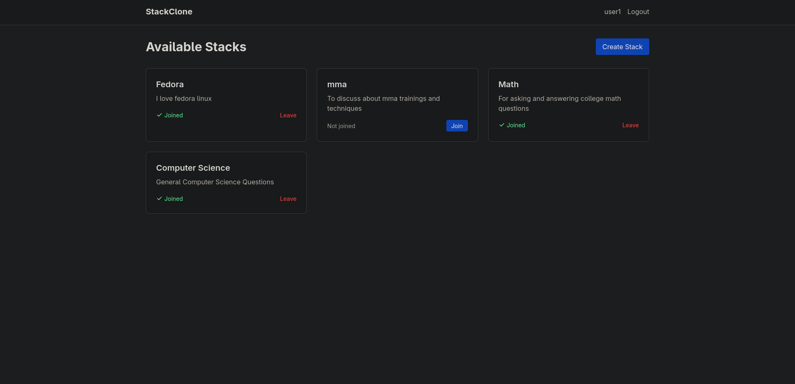
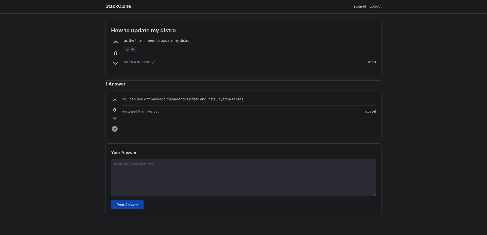

# StackExchange Clone

A multi-community Q&A platform inspired by Stack Exchange, built with Django. Users can create topic-based communities (stacks), ask and answer questions, vote on content, and earn reputation points.



## Features

### Core Functionality
- 🏢 **Multi-Stack System** - Create and join topic-specific communities
- ❓ **Questions & Answers** - Post questions, provide answers
- ⬆️ **Voting System** - Upvote/downvote questions and answers
- 🏆 **Reputation System** - Earn reputation through community engagement
- 🏷️ **Tagging** - Organize questions with tags
- 🔐 **Authentication** - User registration and login

### Technical Features
- Per-stack reputation tracking
- Vote toggle and change functionality
- Responsive design with Tailwind CSS
- PostgreSQL database
- Secure authentication system

## Tech Stack

- **Backend:** Django 6.0
- **Database:** PostgreSQL
- **Frontend:** Django Templates + Tailwind CSS
- **Authentication:** Django's built-in auth system

## Installation

### Prerequisites
- Python 3.12+
- PostgreSQL

### Local Setup

1. **Clone the repository**
```bash
git clone https://github.com/El-basel/stackexchange-clone.git
cd stackexchange-clone
```

2. **Create virtual environment**
```bash
python -m venv venv
source venv/bin/activate  # On Windows: venv\Scripts\activate
```

3. **Install dependencies**
```bash
pip install -r requirements.txt
```

4. **Set up PostgreSQL**
```bash
# Create database
psql postgres
CREATE DATABASE stackexchange_dev;
CREATE USER youruser WITH PASSWORD 'yourpassword';
GRANT ALL PRIVILEGES ON DATABASE stackexchange_dev TO youruser;
\q
```

5. **Configure environment variables**
Create a `.env` file:
```env
SECRET_KEY=your-secret-key-here
DEBUG=True
DB_NAME=stackexchange_dev
DB_USER=youruser
DB_PASSWORD=yourpassword
DB_HOST=localhost
DB_PORT=5432
```

6. **Run migrations**
```bash
python manage.py migrate
```

7. **Create superuser**
```bash
python manage.py createsuperuser
```

8. **Run development server**
```bash
python manage.py runserver
```

Visit `http://localhost:8000`

## Usage

### Creating a Stack
1. Sign up or log in
2. Click "Create Stack"
3. Provide a title and description
4. Start asking questions!

### Asking Questions
1. Join a stack
2. Click "Ask Question"
3. Provide title, description, and tags
4. Submit and wait for answers

### Voting & Reputation
- Upvote: +10 reputation to content owner
- Downvote on answer: -2 reputation to owner, -1 to voter
- Toggle votes by clicking again
- Change vote by clicking the opposite arrow

## Screenshots

### Home Page


### Question Detail
